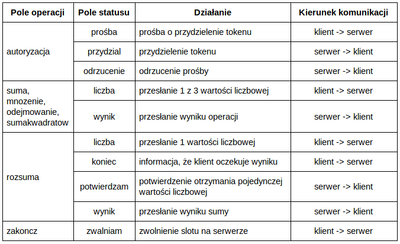

# TextProtocol

# Overview

Prosty kalkulator wykonujące podstawowe operacje arytmetyczne takie jak: dodawanie, odejmowanie, mnożenie czy sumowanie kwadratów.

# Description

Protokół tekstowy obsługujący komunikację klienta z serwerem.
Klient wysyła do serwera wartości , a serwer wykonuje obliczcenia i zwraca je klientowi.
Dane przesyłane są za pomocą znaków ASCII.

Zdefiniowane pola (4 znaki):
- oper - pole operacji
- stat - pole statusu
- iden - pole identyfikatora
- dane - pole danych
- czas - pole znacznika czasu, timestamp

Przykład - prośba o token:
oper#autoryzacja stat#prosba iden#brak dane#69 czas#2018-11-26 19:54:50

# Tools

### Software:
- vscode

### Languages
- node.js
